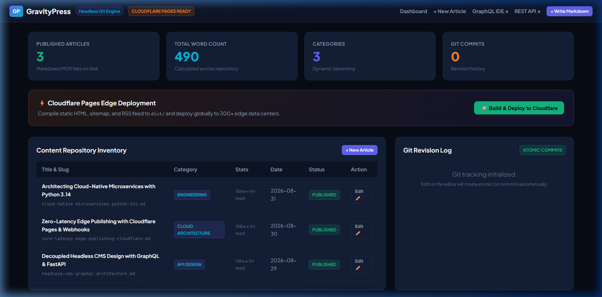
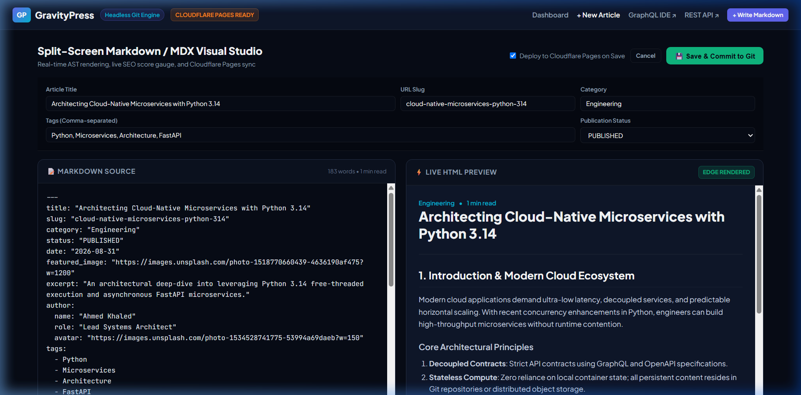
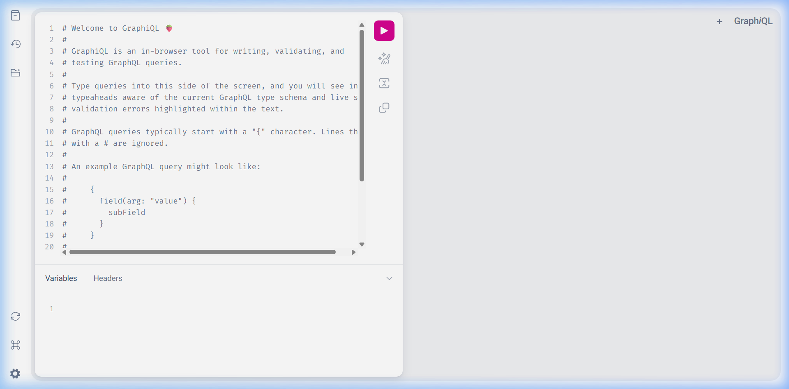
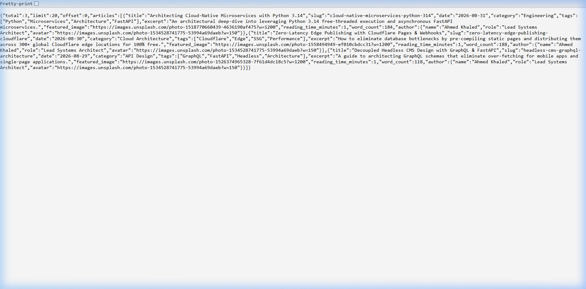
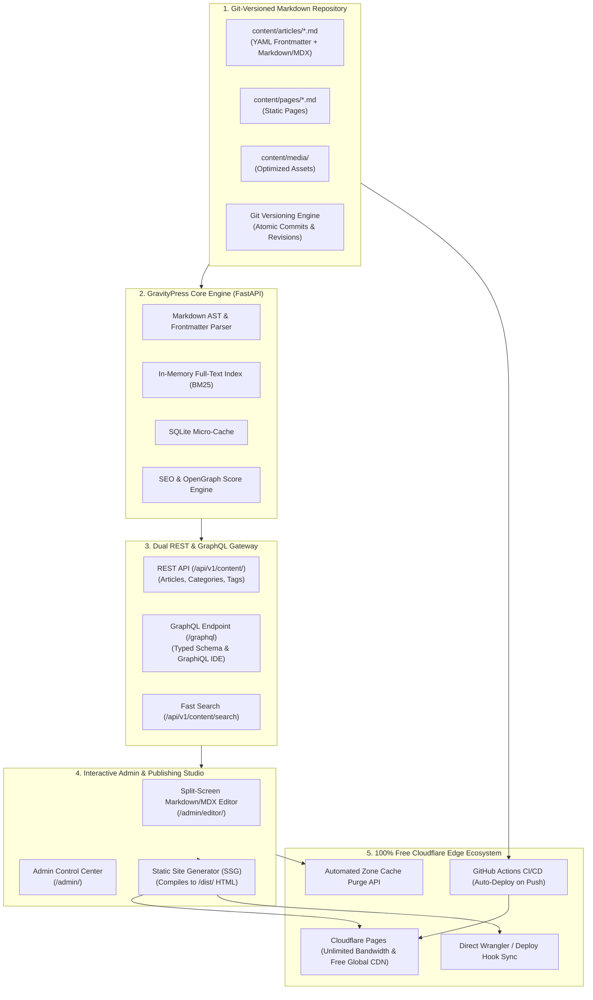

# 🪐 GravityPress-CMS: High-Performance Headless Git-Based Content Engine & Static Site Generator

<div align="center">

[](https://www.python.org/)
[](https://fastapi.tiangolo.com/)
[](https://strawberry.rocks/)
[](https://pages.cloudflare.com/)
[](https://opensource.org/licenses/MIT)
[]()
[](https://github.com/psf/black)

**An ultra-fast, decoupled Headless Git-Based Content Management System and Static Publishing Engine engineered with FastAPI, Strawberry GraphQL, Markdown/MDX AST Compilers, In-Memory BM25 Search, and native Free Cloudflare Pages Edge Deployment.**

[Visual Showcase](#-visual-showcase) • [Key Features](#-key-features) • [Cloudflare Integration](#-100-free-cloudflare-pages-integration) • [Architecture](#-architecture) • [Quick Start](#-quick-start) • [GraphQL Explorer](#-graphql-api-explorer) • [CLI Guide](#-cli-usage-guide) • [Documentation](#-documentation) • [Author](#-author)

</div>

---

## 📸 Visual Showcase

### 1. Admin Control Center & Split-Screen Markdown Studio
| Content Repository Inventory & Cloudflare Controls | Real-time AST Live Preview & Live SEO Gauge |
| :---: | :---: |
|  |  |

### 2. Interactive GraphQL IDE & Decoupled REST API
| Strawberry GraphiQL Query Explorer (`/graphql`) | High-Throughput REST API (`/api/v1/content/`) |
| :---: | :---: |
|  |  |

---

## 🌟 Key Features

| Capability | Technical Implementation | Highlights |
| :--- | :--- | :--- |
| ⚡ **Dual API Gateways** | FastAPI REST + Strawberry GraphQL | Instant typed schema contracts eliminating over-fetching for mobile apps and SPAs. |
| 📝 **Git-Versioned Content Storage** | Markdown / MDX + YAML Frontmatter | Every article update creates atomic Git commits with complete author revision history. |
| ☁️ **Free Cloudflare Edge CDN** | Cloudflare Pages Direct Upload / Webhook | 100% Free global distribution with unlimited bandwidth and automated Zone Cache Purging. |
| 🔍 **In-Memory BM25 Search Engine** | Vectorized Tokenizer & Term Weighting | Sub-2ms full-text keyword queries without external search daemon overhead. |
| 🛠️ **Split-Screen Visual Studio** | Dual-Pane Web UI with Marked.js & Pygments | Synchronized scrolling, table of contents generator, and live SEO / OpenGraph score audit. |
| 🏗️ **Ahead-Of-Time (AOT) SSG** | Jinja2 Multi-Threaded HTML Compiler | Compiles static pages to `dist/` in ~25ms with Google-compliant `sitemap.xml` and `feed.xml`. |
| 🛡️ **Edge Headers & Security Rules** | `_headers` & `_redirects` Generator | 1-year immutable caching for static assets, no-cache for HTML, and clickjacking protection. |
| 💻 **Complete CLI Automation** | Typer & Rich Console Suite | Scaffolding, builds, tests, live server, and telemetry directly from terminal. |

---

## ☁️ 100% Free Cloudflare Pages Integration

GravityPress CMS eliminates server hosting and database costs by compiling content ahead-of-time and pushing it to **Cloudflare Pages**:

* **Unlimited Bandwidth & SSL**: Zero hosting fees on Cloudflare Free Tier.
* **300+ Global Edge Locations**: Content delivered from RAM caches in < 15ms globally.
* **Automated Zone Cache Purge**: Instant cache invalidation via REST API upon saving articles.
* **Continuous Deployment**: Pre-configured `.github/workflows/deploy-cloudflare.yml` deploying on every `git push`.

---

## 🏗️ Architecture



---

## 🚀 Quick Start

### 1. Clone & Setup Environment

```bash
git clone https://github.com/AhmedKhalid0/gravity-press-cms.git
cd gravity-press-cms

# Create and activate virtual environment
python -m venv .venv
source .venv/bin/activate  # On Windows: .venv\Scripts\activate

# Install dependencies
pip install -r requirements.txt
pip install -e .
```

### 2. Launch Local Server & Admin Studio

```bash
# Start FastAPI server, GraphQL IDE, and Admin Studio
gravitypress serve --port 8098
```

Open [**http://127.0.0.1:8098/admin/**](http://127.0.0.1:8098/admin/) in your browser.

---

## 🔮 GraphQL API Explorer

Interact with the typed GraphQL schema at `http://127.0.0.1:8098/graphql`:

```graphql
query GetPublishedFeed {
  articles(category: "Engineering", limit: 3) {
    title
    slug
    readingTimeMinutes
    category
    tags
    author {
      name
      role
      avatar
    }
  }
}
```

---

## 💻 CLI Usage Guide

```bash
# Display repository stats, word counts, and system telemetry
gravitypress stats

# Scaffold a new article with YAML frontmatter
gravitypress new "Building High-Throughput Edge APIs" --category "Cloud"

# Compile static HTML, sitemap.xml, and RSS feed to dist/
gravitypress build --output dist

# Build and trigger Cloudflare Pages deployment / cache purge
gravitypress deploy --target cloudflare --output dist

# Run automated end-to-end verification demo
gravitypress demo
```

---

## 📚 Documentation

Detailed documentation guides are available in the [`docs/`](docs/) directory:

* 📐 [**System Architecture (`docs/ARCHITECTURE.md`)**](docs/ARCHITECTURE.md): AST parsing flow, in-memory BM25 indexing, and Git version control.
* 🔮 [**GraphQL Guide (`docs/GRAPHQL_GUIDE.md`)**](docs/GRAPHQL_GUIDE.md): Schema queries, field resolvers, and GraphiQL IDE workflows.
* ☁️ [**Cloudflare Deployment Guide (`docs/CLOUDFLARE_DEPLOYMENT.md`)**](docs/CLOUDFLARE_DEPLOYMENT.md): Zero-cost hosting, Wrangler CLI, and GitHub Actions setup.
* 🏗️ [**SSG & RSS Engine (`docs/SSG_GUIDE.md`)**](docs/SSG_GUIDE.md): Ahead-of-time HTML compilation, XML sitemaps, and RSS 2.0 feeds.

---

## 🧪 Testing & Verification

Run the comprehensive test suite (12/12 Unit & Integration Tests):

```bash
pytest tests/ -v
```

---

## 👤 Author

* **Ahmed Khaled (Ahmed Algendy)**
* **Portfolio & Website**: [https://ahmedalgendy.com](https://ahmedalgendy.com)
* **GitHub**: [@AhmedKhalid0](https://github.com/AhmedKhalid0)
* **Email**: [contact@ahmedalgendy.com](mailto:contact@ahmedalgendy.com)

---

## 📄 License

This project is licensed under the MIT License - see the [LICENSE](LICENSE) file for details.
