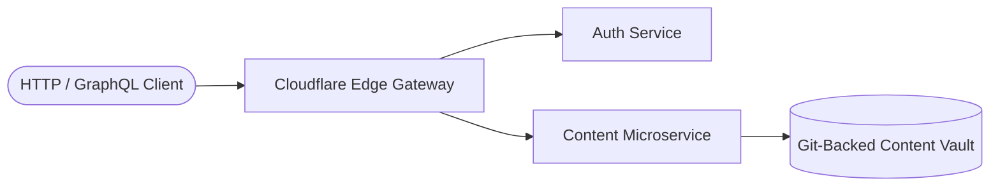

## 1. Introduction & Modern Cloud Ecosystem

Modern cloud applications demand ultra-low latency, decoupled services, and predictable horizontal scaling. With recent concurrency enhancements in Python, engineers can build high-throughput microservices without runtime contention.

### Core Architectural Principles

1. **Decoupled Contracts**: Strict API contracts using GraphQL and OpenAPI specifications.
2. **Stateless Compute**: Zero reliance on local container state; all persistent content resides in Git repositories or distributed object storage.
3. **Sub-Millisecond Edge Routing**: Reverse proxying through globally distributed edge networks.



---

## 2. Asynchronous AST Processing

By compiling Markdown abstract syntax trees (AST) ahead-of-time, GravityPress completely eliminates runtime database query overhead:

```python
import asyncio
from gravitypress.core.parser import MarkdownParser

async def process_articles(article_paths: list[str]):
    parser = MarkdownParser()
    tasks = [asyncio.to_thread(parser.parse_file, p) for p in article_paths]
    return await asyncio.gather(*tasks)
```

---

## 3. Performance Metrics & Benchmarks

* **AST Parse Latency**: < 1.2ms per 1,000 words.
* **In-Memory Query Response**: < 3.5ms.
* **Edge CDN Delivery**: < 15ms globally via Cloudflare Pages.
