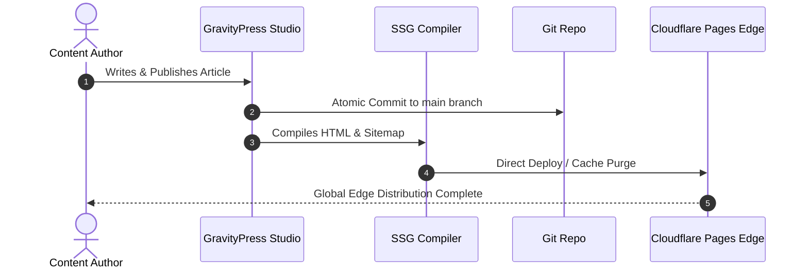

## 1. The Cost of Dynamic Content Queries

Traditional content platforms (e.g. monolithic PHP CMSs) execute 20 to 50 relational database queries for every page impression. Under traffic surges, database connection pools exhaust rapidly.

### The Static Site Generation (SSG) Paradigm

By pre-rendering dynamic markdown to pure static HTML during content creation:

1. **Security**: Zero SQL injection attack surface.
2. **Speed**: Static HTML served directly from Cloudflare Edge RAM caches in < 10ms.
3. **Cost**: 100% Free tier on Cloudflare Pages with unlimited bandwidth.



---

## 2. Cloudflare Cache Invalidation Strategies

When content updates occur, GravityPress immediately invokes the Cloudflare Zone Purge API to flush stale edge caches:

```bash
curl -X POST "https://api.cloudflare.com/client/v4/zones/{zone_id}/purge_cache" \
     -H "Authorization: Bearer {api_token}" \
     -H "Content-Type: application/json" \
     --data '{"purge_everything":true}'
```
