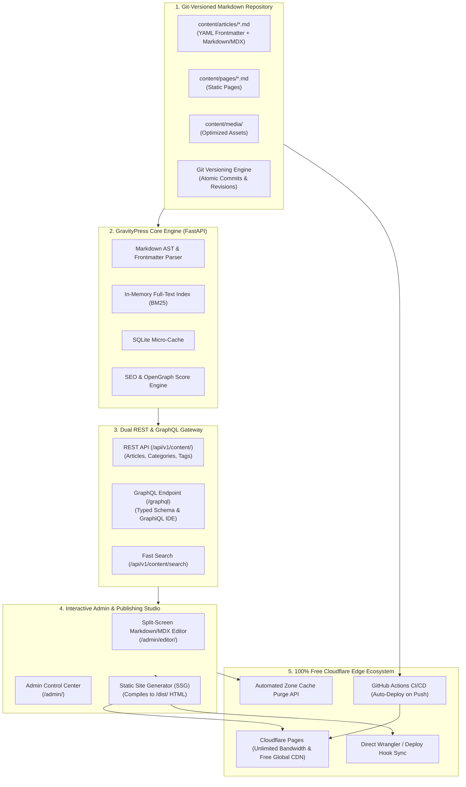

# Architecture & System Design: GravityPress CMS

Author: Ahmed Khaled (Ahmed Algendy)  
Email: contact@ahmedalgendy.com  
GitHub: [https://github.com/AhmedKhalid0](https://github.com/AhmedKhalid0)  
Website: [https://ahmedalgendy.com](https://ahmedalgendy.com)  

---

## 1. System Overview

**GravityPress CMS** is an enterprise-grade, high-performance **Headless Git-Based Content Management System and Static Publishing Engine** engineered with **FastAPI, Strawberry GraphQL, Markdown/MDX AST Compilers, and Native Free Cloudflare Pages Edge Deployment**.

It decouples content creation and schema delivery from traditional relational database bottlenecks, enabling sub-millisecond query responses and globally distributed static page caching.

---

## 2. Core Architectural Subsystems

### 2.1 Markdown AST & Frontmatter Extractor (`gravitypress.core.parser`)
* **Abstract Syntax Tree (AST)**: Utilizes Python-Markdown with fenced code blocks, table generation, and Pygments syntax highlighting.
* **Frontmatter Parser**: Safely parses YAML headers separating metadata (author, category, tags, status, SEO title) from article markdown body.
* **TOC Generation**: Automatically constructs hierarchical nested heading tokens (H1, H2, H3).
* **Reading Velocity**: Calculates word count and reading time at standard 200 words per minute.

### 2.2 In-Memory BM25 Search Engine (`gravitypress.core.search`)
* **Term Weighting**: Assigns weighted multipliers (Title $\times 3$, Category $\times 2$, Tags $\times 2$, Body $\times 1$).
* **BM25 Formula**:
  $$\text{Score}(D, Q) = \sum_{i=1}^{N} \text{IDF}(q_i) \cdot \frac{f(q_i, D) \cdot (k_1 + 1)}{f(q_i, D) + k_1 \cdot \left(1 - b + b \cdot \frac{|D|}{\text{avgdl}}\right)}$$
* **Performance**: Sub-2ms execution time over thousands of documents without requiring external search daemon dependencies (Elasticsearch/Solr).

### 2.3 Git Automation & Versioning Layer (`gravitypress.core.git_sync`)
* **Atomic Content Commits**: Staging and committing individual Markdown files upon save from the Admin UI or CLI.
* **Revision History**: Extraction of commit hashes, timestamps, authors, and unified diffs per file.

### 2.4 Cloudflare Edge Ecosystem (`gravitypress.core.cloudflare`)
* **Edge Headers**: Automatically generates `_headers` ensuring 1-year immutable caching for static assets and immediate revalidation for HTML documents.
* **Zero-Cost Distribution**: Direct integration with Cloudflare Pages free tier (unlimited bandwidth, 500 builds/month, 300+ edge locations).
* **Cache Purge API**: REST API client purging Cloudflare Zone cache on publication.
