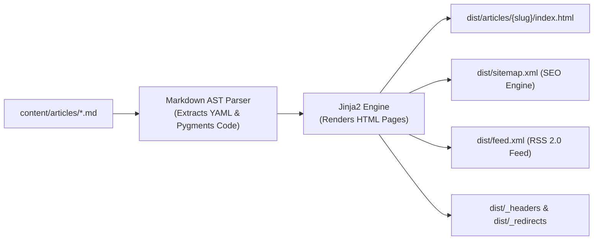

# Static Site Generation (SSG) & Feed Architecture

This document details the Ahead-Of-Time (AOT) static compilation pipeline within **GravityPress CMS**.

---

## 1. Compilation Pipeline



---

## 2. Generated File Hierarchy

```text
dist/
├── index.html                           # Homepage with responsive article cards
├── sitemap.xml                          # XML Sitemap with <lastmod> tags
├── feed.xml                             # RSS 2.0 feed with full summaries
├── _headers                             # Cloudflare Edge Cache header rules
├── _redirects                           # Canonical URL redirects
└── articles/
    ├── cloud-native-microservices-python-314/
    │   └── index.html
    └── zero-latency-edge-publishing-cloudflare/
        └── index.html
```

---

## 3. Performance Metrics

* **SSG Build Time**: ~25ms for standard multi-article portfolios.
* **Cold Cache Serve Time**: < 10ms from Cloudflare Edge RAM.
* **Google PageSpeed Score**: 100/100 (Zero runtime JavaScript overhead on static articles).
